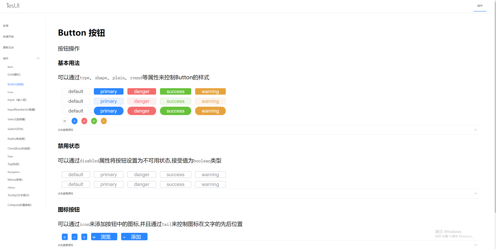

# TesUI
基于Tes框架，搭建的一套UI控件
## 准备工作
### tsx编译
项目使用tsx搭建,需要解决由tsx到js的编译过程,首先`@babel/preset-react`会将tsx文件中关于`HTML`部分代码转换为`React.createElement`,我们手动将其转换成`createElement`,然后通过编写`babel`插件`src/plugins/transform-jsx`将其引入所有文件,这样就完成了`tsx`到`js`的编译
### example文件
example文件中是当前UI空间的展示页面,内部提供自定义的路由组件的简单实现`Router`
```jsx
@Component
export class Router extends Control {
  protected render() {
    return (
      <div>
        {this.$children}
      </div>
    )
  }
}

interface RouterProps {
  className?: string,
  style?: string,
  path: string,
  //支持组件懒加载
  component: () => Promise<any> | VNode 
}
@Component
export class Route extends Control<RouterProps> {
}
```
**使用方法:**
```jsx
const Routers = [
  { path: '#components/button', menu: 'button', component: () => import (/* webpackChunkName: "ui-Button" */"./Button/index") },
  { path: '#components/grid', menu: 'grid', component: () => import (/* webpackChunkName: "ui-Grid" */"./Grid/index") }
]
<Router>
    {
        Routers.map((item) => {
            return (
                <Route path={item.path} component={item.component} />
                );
            })
     }
</Router>
```

## 部分截图
